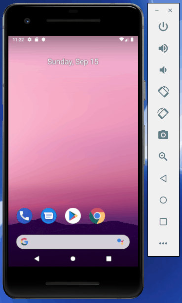

# Dice Roller

An Android application that simulates a dice roll.

Submitted by: Kimberly McGimpsey

Time spent: 12 hours

## User Stories

The following **required** functionality is complete:

* [x] Implemented LinearLayout view group.
* [x] Added interactive button.
* [x] Optimize app by using lateinit to search view hierarchy only once.
* [x] User can press button to simulate a die roll.

The following **additional** features are implemented:

* [ ] List anything else that you can get done to improve the app functionality!

## Video Walkthrough 

Here's a walkthrough of implemented user stories:

## Notes

Describe any challenges encountered while building the app.

Only challenges was trying to see the text in the video, getting a warning that was not the same as on the video, and trying to get this on the GIT app. Updated this to say I had trouble changing the files name to match the names on here and it was troubling for me.

## License

Copyright 2018 Kimberly McGimpsey

Licensed under the Apache License, Version 2.0 (the "License");
you may not use this file except in compliance with the License.
You may obtain a copy of the License at

http://www.apache.org/licenses/LICENSE-2.0

Unless required by applicable law or agreed to in writing, software
distributed under the License is distributed on an "AS IS" BASIS,
WITHOUT WARRANTIES OR CONDITIONS OF ANY KIND, either express or implied.
See the License for the specific language governing permissions and
limitations under the License.
